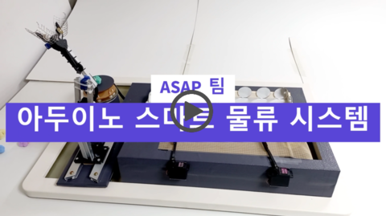

# Arduino_Smart_Logistics_System
아두이노 스마트 물류시스템

## 개요
본 프로젝트는 아두이노와 센서를 이용한 스마트 물류 분류 시스템입니다.  
실시간 모니터링 및 제어가 가능하며, 직관적인 관리 프로그램을 통해 효율적인 물류 작업을 지원합니다.

- 개발 언어 : C++  
- 개발 환경 :
    * Windows 11
    * Arduino
        * Arduino IDE
    * Qt
        * Qt Creator 14 IDE
        * Qt 6.5.3 MinGW 64-bit
    * etc
        * Python 3.12.5
        * MySQL Community 8.0  
  
- 개발 기간 : 2024.04.09 ~ 2024.11.04  

***
## 기능
#### HW 기능
* 아두이노 기반의 스마트 물류시스템 구성

__1. 물품 인식 및 측정__  
&nbsp;&nbsp;&nbsp;&nbsp;• 로드셀(Loadcell)과 RFID 센서를 활용해 물품의 무게와 식별 정보를 실시간으로 인식합니다.  
&nbsp;&nbsp;&nbsp;&nbsp;• 로드셀은 물품의 정확한 무게를 측정하고, RFID 센서는 물품의 종류 및 관련 정보를 판별합니다.  

__2. 물품 분류 및 이동__  
&nbsp;&nbsp;&nbsp;&nbsp;• 로봇팔은 물품을 집어 컨베이어 벨트로 옮기고, 지정된 물품 분류기가 물품을 이동시킵니다.  
&nbsp;&nbsp;&nbsp;&nbsp;• 물품 분류기는 RFID와 무게 정보를 바탕으로 정확히 물품을 분류합니다.  

__3. 실시간 모니터링 및 관리__  
&nbsp;&nbsp;&nbsp;&nbsp;• 관리 프로그램을 통해 작업 상태를 실시간으로 모니터링하고 제어 합니다.  

***
#### SW 기능
* 스마트 물류 시스템의 관리 프로그램

1. 관리 프로그램은 작업 단계별 발생 정보를 실시간으로 업데이트합니다.
2. 대시보드를 통해 물품의 상태 확인 및 추가, 제거를 할 수 있습니다.  
3. 새로고침 기능으로 최신 작업 상태가 즉시 반영하여 작업의 효율성을 높입니다.  
  
***
#### 블록 다이어그램

#### SW 관계도

***
## 시연 영상

## 팀원
<table border="1">
    <tr>
        <td align="center"></td>
        <td align="center"></td>
    </tr>
    <tr>
        <td align="center">김현준 (HW 개발 및 팀장)</td>
        <td align="center">이대은 (SW 개발 및 PM)</td>
    </tr>
</table>

##### NOTE
* 프로젝트 발표 자료 [[Link]](https://github.com/2daeeun/Arduino_Smart_Logistics_System/blob/docs/docs/4학년%201학기%205_ASAP%20프로젝트_구현_및_데모_%28최종%29.pdf)
* 프로젝트 계획서 자료 [[Link]](https://github.com/2daeeun/Arduino_Smart_Logistics_System/blob/docs/docs/4학년%201학기%20최종보고서.pdf)
